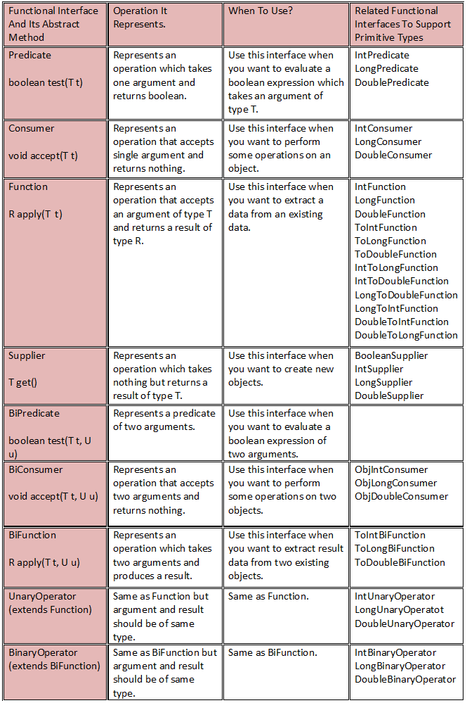

### Use primitive and binary variations of base interfaces of `java.util.function` package

Every Java type is either a reference type (i.e `String`, `Integer`, etc) or a primitive type 
(i.e `int`, `double`, etc). But generic parameters (i.e the `T` in `Consumer<T>`) can be bound only to reference types.

A specialized version of the functional interfaces exists in order to avoid autoboxing operations when the inputs or 
outputs are primitives

Some of these interfaces have been listed or mentioned in previous sections but the table below outlines the ones 
required for the exam

[Reference 11](../bibliography.md)

| [Previous](use_built-in_functional_interfaces_including_predicate_consumer_function_and_supplier.md) | [Next](../parallel_streams) |
| :--------- | ----------: | 