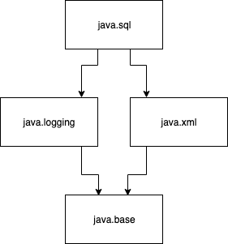

### Describe the Modular JDK​

The Modular JDK was introduced in Java 9 as part of Project Jigsaw.
Its goal was to divide the JDK into a set of modules that can be combined at compile time, build time, and run time into a variety of configurations including, but not limited to:
- Configurations corresponding to the full Java SE Platform, the full JRE, and the full JDK;
- Configurations roughly equivalent in content to each of the Compact Profiles defined in Java SE 8;
- and Custom configurations which contain only a specified set of modules possibly augmented by external library and
 application modules, and the modules transitively required by all of these modules.

The definition of the modular structure was also to make a clear distinction between standard modules,
whose specifications are governed by the Java Community Process, and modules that are specific to the JDK.

It would also distinguish modules that are included in the Java SE Platform Specification, and thereby made mandatory
 in every Platform Implementation, from all other modules. [3](../bibliography.md)

#### Design Principles

The modular structure of the JDK implements the following principles:
1. Standard modules, whose specifications are governed by the JCP, have names starting with the string `"java."`.

2. All other modules are merely part of the JDK, and have names starting with the string `"jdk."`.

3. If a module exports a package that contains a type that contains a public or protected member that, in turn, refers
 to a type from some other module, then the first module must grant implied readability to the second, via `requires transitive`.
 (This ensures that method-invocation chaining works in the obvious way.)

4. A standard module may contain both standard and non-standard API packages.
If a standard module exports a standard API package then the export may be qualified;
if a standard module exports a non-standard API package then the export must be qualified.
In either case, if a standard module exports a package with qualification then the export must be to some subset of the modules in the JDK.
If a standard module is a Java SE module, i.e., is included in the Java SE Platform Specification, then it must not export any non-SE API packages, at least not without qualification.

5. A standard module may depend upon one or more non-standard modules. It must not grant implied readability to any non
-standard module. If it is a Java SE module then it must not grant implied readability to any non-SE module.

6. A non-standard module must not export any standard API packages. A non-standard module may grant implied readability
 to a standard module. [3](../bibliography.md)

#### The Module Graph
As Java modules depend on one another, we can draw a complete graph of dependencies where each module is a node, and there is a directed edge from one module to another if the first depends upon the second.



#### jlink: The Java Linker
You can use the `jlink` tool to assemble and optimize a set of modules and their dependencies into a custom runtime
 image [4](../bibliography.md). The resulting image is much smaller than the entire JDK.

```shell script
jlink [options] --module-path modulepath --add-modules module [,module...]
```

#### jlink example
The following command creates a runtime image in the directory `greetingsapp`.
This command links the module com.greetings, whose module definition is contained in the directory `mlib`.
The directory `$JAVA_HOME/jmods` contains java.base.jmod and the other standard and JDK modules.

```shell script
jlink --module-path $JAVA_HOME/jmods:mlib --add-modules com.greetings --output greetingsapp
```

The `-–add-modules` option defines a comma separated list of modules to include in the new JRE.
The `-–output` option defines the target directory where our custom JRE should be generated.